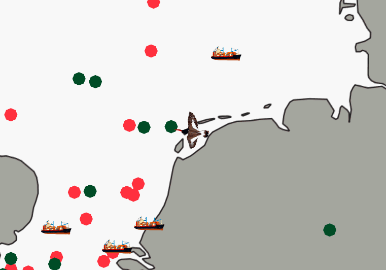

# Interactive Particle Track and Trace

This project seeks to interactively visualise the motion of particles in the Dutch North Sea to raise awareness about Ocean litter.

Two approaches will be produced and evaluated, to answer the research question: **How does a dedicated interaction-reward scheme impact the engagement with a visual simulation of floating marine debris?**

## Base Interaction Approach

## Gamified Reward Scheme Interaction Approach

